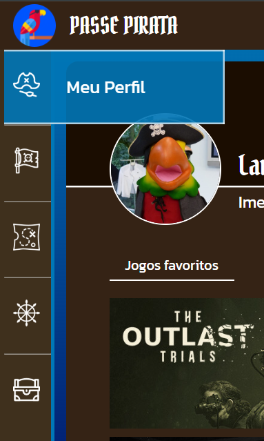
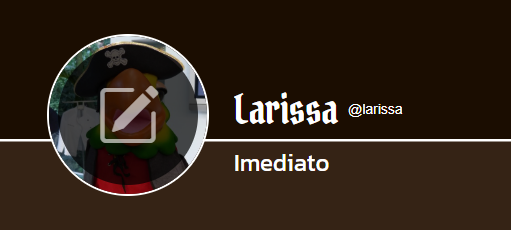
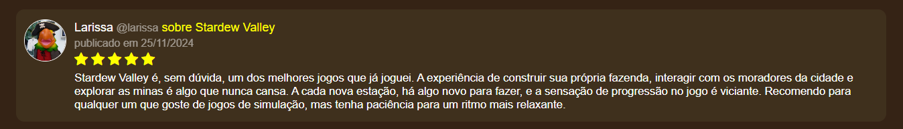

<a href="br">README em português</a> | <a href="en">README in English</a>

<h3 id="br">Tópicos:</h4>
<ul>
  <li>Descrição breve</li>
  <li>Funcionalidades</li>
  <li>Banco de dados</li>
</ul>

<h2>Descrição breve</h1>

Esse projeto visou a construção de uma plataforma de jogos (como a do XBOX Gamepass) no formato de uma página web, a qual demos o nome de "Passe Pirata" e tematizamos de acordo. Foi um trabalho em conjunto, mas aqui darei foco no que eu implementei.

Meu foco foi o back-end com Node.js, mas também fiquei responsável pelo front-end da página do perfil do usuário e de solicitação e pendências de pedidos de amizade. Não contávamos ainda com conhecimentos de UX ou com um integrante que entendesse do assunto, então fizemos um design improvisado.

 

<h2>Funcionalidades</h2>
Aqui estão listadas algumas funcionalidades para que se entenda a dinâmica do site:

<ul>
  <li>
    <h3>Barra de navegação lateral</h3>
    Os nomes das páginas aparecem conforme se passa o cursor. 
    Para navegar entre as páginas "Meu Perfil", "Amigos", "Planos", "Dispositivos" e "Meus pagamentos".
      
    
    

  </li>

  <li>
    <h3>Edição da foto de perfil</h3>
    O usuário pode escolher entre imagens pré-definidas de piratas ou fazer upload de alguma foto do seu computador
      
    
    
    

  </li>

  <li>
    <h3>Aba de jogos favoritos</h3>
    A aba "Jogos Favoritos" mostra os jogos favoritados pelo usuário em uma grid. Para favoritar um jogo, basta ir na respectiva página do jogo e clicar no botão de favoritar.
      
    
    

  </li>

  <li>
    <h3>Aba de amigos</h3>
    Permite que se veja os amigos <strong>daquele</strong> usuário. 
    Mais sobre amizades <a href="amigos">neste tópico</a>.
      
    
    

  </li>

  <li>
    <h3>Aba de avaliações</h3>
    Mostra as avaliações do usuário. 
    Mais sobre avaliações <a href="avaliacoes">neste tópico</a>.
      
    
    

  </li>

  <li>
    <h3>Aba dos dados do usuário</h3>
    Onde o usuário logado pode editar suas informações.
      
    
    
    
    

  </li>

  <li>
    <h3>Aba lateral de amigos</h3>
    Mostra as amizades do usuário <strong>que está logado</strong>. Permite fazer busca pelo username.
      
    
    
    

  </li>

  <li id="amigos">
    <h3>Solicitações e pendências de amizades</h3>
    Na aba à esquerda, o usuário pode pesquisar usuários a partir do seu username para mandá-los pedidos de amizade. É possível que apareçam contas com as quais já se tenha amizade, mas nesse caso não está disponível o botão de solicitação. 
    Na aba a direita ficam os pedidos pendentes. Eles podem ser aceitos ou recusados.
    Quando um pedido é aceito, dispara no banco de dados a <a href="trigger-amizade">trigger adicionar_amizade_apos_aceite()</a>
      
    
    

  </li>

  <li id="avaliacoes">
    <h3>Avaliações de jogos</h3>
    Os jogos podem ser avaliados pelos usuários, e essas avaliações ficam tanto em seus perfis como na página do jogo. 
    Nosso sistema utiliza a clássica avaliação por estrelas, que afetam a média geral do jogo por meio da <a href="trigger-avaliacao">trigger atualizar_media_avaliacao()</a>.
      
    
    

  </li>
</ul>

 

<h2>Banco de dados</h2>

O banco de dados foi feito no PostgreSQL e composto pelas tabelas:

<ul>
  <li>Avaliacao</li>
  <li>Jogo</li>
  <li>Genero</li>
  <li>Jogo_Genero</li>
  <li>Midia_Jogo</li>
  <li>Usuario</li>
  <li>Foto_Perfil</li>
  <li>Plano</li>
  <li>Jogo_Plano</li>
  <li>Dispositivo</li>
  <li>Dispositivo_Plano</li>
  <li>Amizade</li>
  <li>Solicitacao_Amizade</li>
  <li>Tipo_Pagamento</li>
  <li>Forma_Pagamento</li>
  <li>Pagamento</li>
</ul>

Como nos foi pedido que praticássemos os conceitos de View, Trigger e Stored Procedure aprendidos em sala, criamos as seguintes:

<ul>
  <li><strong>Trigger adicionar_amizade_apos_aceite() -</strong> para que toda vez que uma solicitação de amizade pendente é aceita, acionar uma função que adiciona um novo registro na tabela Amizade.</li>
  <li><strong>Trigger atualizar_media_avaliacoes() -</strong> para toda vez que uma avaliação for adicionada, acionar uma função que atualiza a média do jogo avaliado.</li>
  <li><strong>Trigger atualizar_plano() -</strong> quando um usuário faz um pagamento de assinatura, aciona uma função que atualiza seu plano de assinatura na plataforma.</li>
  <li><strong>View view_info_jogos -</strong> reúne as informações dos jogos, uma vez que gêneros e mídias ficam em tabelas separadas.</li>
  <li><strong>Stored Procedure TrocarAssinaturasVencidas() -</strong> verifica assinaturas que já venceram (e que não tenha sido realizado o pagamento regular) e atualiza o plano dos respectivos usuários para o plano gratuito.</li>
</ul>
 

 
<h4 id="en">Tópicos:</h4>
